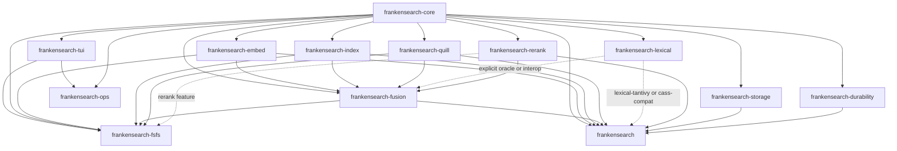
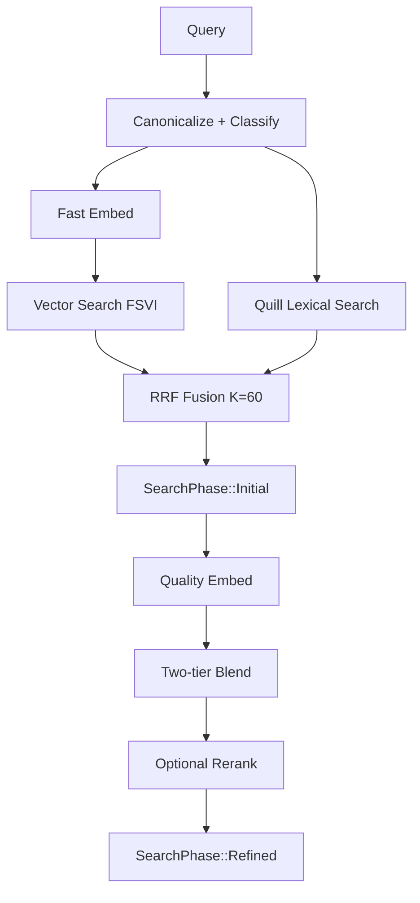

# frankensearch Architecture Overview

This document is the contributor-facing map of the current `frankensearch` workspace. It focuses on runtime behavior, crate boundaries, and the design choices that matter when you are changing code.

## 1) Workspace Crate Map (15 Members)

| Crate | Purpose |
|---|---|
| `frankensearch-core` | Shared contracts: traits (`Embedder`, `LexicalRead`, …), errors, config, canonicalization, query classes, telemetry types |
| `frankensearch-embed` | Embedder implementations (hash control, Model2Vec/potion, FastEmbed/MiniLM, native multilingual) and model discovery/cache/download glue |
| `frankensearch-index` | FSVI vector format, search kernels (brute force, optional `ann` via `frankenhnsw`, in-tree `native_hnsw` not yet on the search path), index builders |
| `frankensearch-quill` | Native pure-Rust BM25 lexical engine (FSLX segments, delta-visible indexing); the default lexical backend behind the facade `lexical`/`quill` features and the only one `fsfs` ships |
| `frankensearch-lexical` | Tantivy-backed lexical implementation, retained as the pinned conformance oracle (`lexical-tantivy`) and for external CASS schema-v8 interop (`cass-compat`); not in default builds |
| `frankensearch-quill-gauntlet` | Differential conformance / metamorphic / perf gauntlet certifying Quill against the Tantivy oracle (`publish = false`) |
| `frankensearch-fusion` | RRF fusion, blending, progressive two-tier search orchestration (`TwoTierSearcher`) |
| `frankensearch-rerank` | Optional cross-encoder reranking: pure-Rust frankentorch `native` backend used by the library and `fsfs search --rerank`; FastEmbed/ONNX is a separate optional library backend |
| `frankensearch-storage` | FrankenSQLite metadata, dedup/content-hash, persistent embedding queue |
| `frankensearch-durability` | RaptorQ repair trailer and protect/verify/repair workflows for Quill segments and FSVI |
| `frankensearch-fsfs` | Standalone CLI/TUI search product (`fsfs`) built on library crates |
| `frankensearch-tui` | Shared TUI framework primitives (screens/shell/input/replay/theme) |
| `frankensearch-ops` | Fleet/operations console crate on top of `frankensearch-tui` (library + simulator-fed binary; no shipped telemetry source yet) |
| `frankensearch` | Facade crate that re-exports public APIs across the workspace |
| `tools/optimize_params` | Parameter search helper (`optimize-params`, `publish = false`) |

High-level dependency arrows:

```text
frankensearch-core
  -> frankensearch-embed
  -> frankensearch-index
  -> frankensearch-lexical
  -> frankensearch-fusion
  -> frankensearch-rerank
  -> frankensearch-storage
  -> frankensearch-durability
  -> frankensearch-tui

frankensearch-quill  -> (core, index formats; optional durability)
frankensearch-fusion -> (embed, index, optional quill/lexical/rerank)
frankensearch-quill-gauntlet -> (quill, lexical as the pinned Tantivy oracle, fusion)
frankensearch-fsfs   -> (core, embed, index, fusion, quill, storage, durability, tui, optional native rerank; lexical only behind `shadow-oracle`)
frankensearch-ops    -> (core, tui)
frankensearch facade -> (core, embed, index, fusion, quill by default for `lexical`; optional lexical-tantivy/rerank/storage/durability)
```

Mermaid dependency view:



## 2) End-to-End Data Flow

### Indexing path

```text
document
  -> canonicalize (NFC/cleanup)
  -> embed (fast tier; also quality tier in ordinary fsfs indexing)
  -> persist vectors in FSVI generations
  -> persist metadata/queue state in FrankenSQLite
  -> lexical indexing via Quill (facade lexical feature; always in fsfs)
```

### Query path

The following is the library's `TwoTierSearcher` pipeline. `fsfs` has a separate
orchestrator in `crates/frankensearch-fsfs/src/runtime.rs`; its command, daemon,
cache, streaming, and TUI paths must wire each policy explicitly. A library
builder or default alone does not establish product behavior.

The fsfs orchestrator retains independent fast and quality candidate pools and
calls `frankensearch_fusion::blend_two_tier` with the effective
`search.quality_weight` (default `0.7`, converted once to `f32`). The shared
helper normalizes each pool and joins scores by document ID. A document present
in both pools gets `weight * quality + (1 - weight) * fast`; a document present
in only one keeps that source's normalized score. fsfs then RRF-fuses the blended
semantic ranking with the lexical head and applies optional reranking. Daemon
requests acknowledge the caller's policy; cache keys retain the effective
weight, exact RRF configuration, and deadline. Explanation payloads retain the
source scores, blend weights, and joint lexical/vector RRF contributions.

```text
query
  -> parse + classify
  -> embed query (fast tier)
  -> search vector index (FSVI; optional ANN)
  -> search lexical index (Quill by default; explicit Tantivy interop supported)
  -> RRF fuse
  -> emit initial results
  -> embed/refine with quality model
  -> blend scores
  -> optional cross-encoder rerank
  -> emit refined results
```

Mermaid search flow:



## 3) Two-Tier Strategy (Why It Exists)

The architecture intentionally separates speed and quality:

- Fast tier gets early, useful answers quickly (interactive latency budget).
- Quality tier spends more compute to improve ranking after initial display.

Practical effect:

- better perceived latency for users and agent workflows
- an opportunity to improve final ranking, subject to corpus-specific quality evaluation
- graceful degradation when quality models are missing or fail

Progressive API contract:

- `SearchPhase::Initial`
- `SearchPhase::Refined`
- `SearchPhase::RefinementFailed`

The facade exposes the library phases. `fsfs` emits its own corresponding phase
artifacts and `fsfs.stream.query.v1` events. Native cross-encoder support is
compiled by its default `rerank` Cargo feature, but scoring is opt-in through
`fsfs search --rerank` or `search.rerank`. Provision its model with
`fsfs download-models ms-marco-minilm-l-6-v2`.

In fsfs, `search.quality_timeout_ms` starts after the Initial artifact is
produced and its streaming phase sink returns. It covers cold quality-model
initialization, waiting for model capacity, inference, and quality-index
retrieval. Expiry yields `RefinementFailed` with the Initial hits and a typed
timeout reason; caller cancellation propagates separately. Blending, lexical
fusion, and optional reranking follow successful retrieval outside this window.
This deadline does not bound total command duration or establish a measured
latency or quality improvement.

## 4) Storage Model

Three storage concerns are explicitly separated:

1. Vector storage: FSVI files (`frankensearch-index`)
2. Lexical storage: Quill FSLX segments (`frankensearch-quill`); Tantivy layouts are confined to the explicit oracle/CASS interop lane
3. Metadata/job state: FrankenSQLite (`frankensearch-storage`)

Why split:

- each subsystem can optimize for its access pattern
- vector search remains SIMD/mmap focused
- metadata and queues stay transactional and durable
- lexical ranking keeps BM25 semantics and query parsing isolated

## 5) Durability Layer

`frankensearch-durability` adds corruption detection/repair primitives around persistent files, including:

- RaptorQ FEC sidecar materialization/validation for recoverability
- repair trailer I/O
- file/segment verification and repair orchestration
- durability metrics and health reporting

This layer is deliberately optional so lightweight deployments can skip its overhead, while higher-durability environments can enable it.

## 6) Async Runtime Model (asupersync, not tokio)

The workspace uses `asupersync` for async/concurrency contracts.

FastEmbed inference requires a blocking pool supplied by the caller's runtime
through `Cx`. The fsfs main runtime and each socket request runtime configure
that pool. Quality-model initialization and index scans also run on blocking
workers so the executor can drive the deadline. A synchronous ONNX call already
in progress cannot be preempted: it retains its model permit until completion,
and the runtime joins its worker during shutdown. Process exit can therefore
follow the timeout response later. The socket daemon flushes the response and
closes its write side before dropping the request runtime and joining its pool.

Operational implications:

- async functions receive a `Cx` capability context
- cancellation and scoped task lifetimes are part of normal control flow
- runtime behavior is explicit in API boundaries (especially embed/search/rerank paths)

Why it matters to contributors:

- do not add tokio/hyper/reqwest patterns
- preserve `Cx` plumbing in new async code
- keep cancellation-correct behavior when adding queues/workers/search phases

## 7) Key Design Decisions and Rationale

- f16 quantization for vector storage
  - reduces vector footprint materially while retaining ranking quality for cosine-style retrieval
- RRF with `K=60`
  - robust rank-based fusion across lexical and semantic lists without fragile score normalization coupling
- progressive iterator/phase model
  - enables fast-first UX with quality refinement as a second phase
- NaN-safe ordering in ranking operations
  - deterministic behavior even with problematic floating-point edge cases

These are foundational decisions; changes here require explicit measurement and migration planning.

## 8) Contributor Onramp: Where To Read Code First

Start with these files:

- `frankensearch/src/lib.rs` (facade surface and re-exports)
- `crates/frankensearch-core/src/lib.rs` (contracts/types)
- `crates/frankensearch-fusion/src/searcher.rs` (progressive orchestration)
- `crates/frankensearch-index/src/lib.rs` and `crates/frankensearch-index/src/two_tier.rs` (vector index/search)
- `crates/frankensearch-quill/src/index.rs` and `src/argus.rs` (default lexical storage and BM25 execution)
- `crates/frankensearch-lexical/src/lib.rs` (explicit Tantivy oracle/CASS integration)
- `crates/frankensearch-fsfs/src/main.rs` + `crates/frankensearch-fsfs/src/adapters/cli.rs` (standalone product surface)

Then inspect:

- `docs/fsfs-config-contract.md`
- `docs/fsfs-dual-mode-contract.md`
- `docs/fsfs-packaging-release-install-contract.md` (including host migration playbooks)
- `docs/fsfs-packaging-release-install-contract.md#upgrade-and-migration-compatibility-verification-strategy`
- `docs/ops-tui-ia.md#operator-runbook-production-use`
- `AGENTS.md`

## 9) Ops Control-Plane Data Flow + Contract Surface

The ops control-plane remains experimental (`bd-p6k61`, 2026-09-02): no shipped
telemetry producer feeds it and it is excluded from release builds. The flow
below is the integration design, not evidence of production host adoption.

```text
host app adapter
  -> telemetry envelope (schema + redaction policy)
  -> ingestion/store (FrankenSQLite raw + summarized windows)
  -> alert/slo/anomaly evaluators
  -> ops query API
  -> TUI screens (fleet/project/stream/history/explainability)
```

Key semantics:

- SLO and anomaly state MUST use one shared taxonomy across all hosts.
- Error severity and recovery guidance are contract-defined, not ad hoc.
- Replay artifacts and reason codes are required for incident triage.

Core contract references:

| Contract | What it defines |
|---|---|
| `docs/control-plane-interface.md` | API surface and data model for fleet/project/stream queries |
| `docs/slo-anomaly-contract.md` | SLO budgets, anomaly lifecycle, and reason fields |
| `docs/control-plane-error-contract.md` | Severity classes, recovery guidance, and UI escalation |
| `docs/observability-contract.md` | Event taxonomy (`decision/alert/degradation/transition/replay_marker`) |
| `docs/evidence-jsonl-contract.md` | Replay-safe evidence schema + redaction policy |
| `docs/cross-epic-telemetry-adapter-lockstep-contract.md` | Host adapter lockstep/versioning/conformance requirements |

## 10) Scope Notes

## 11) Sprint 2 Release-Readiness Snapshot (`bd-3vw3`)

This section preserves the February 2026 bookkeeping snapshot. Its closure
counts and gate decisions do not establish current delivery or override the
later experimental Ops decision above. Current source validation uses
`scripts/quality-gate.sh` through DSR; GitHub Actions is disabled.

Snapshot time: `2026-02-15T04:35Z` (from `br` + `bv --robot-*` outputs).

### Gate Decision Records

| Gate / Policy bead | Status | Closed at (UTC) | Decision record |
|---|---|---|---|
| `bd-ehuk` (release gate) | `closed` | `2026-02-15T03:44:03.768970671Z` | Close reason records that blocker dependencies were closed and interaction-matrix artifacts/tests/sign-off prerequisites were satisfied. |
| `bd-1pkl` (composition-matrix policy gate) | `closed` | `2026-02-15T04:07:04.505835470Z` | Policy gate marked complete; required composition-linkage governance is now closed. |
| `bd-ls2f` (reproducibility contract) | `closed` | `2026-02-15T03:42:53.427719531Z` | Close reason records `env.json` + `repro.lock` contract implementation plus validator-backed coverage. |

`bd-3vw3` blocker check: `13/13` `blocks` dependencies are currently `closed`.

### Composition Coverage Evidence

| Coverage lane | Evidence surface | Replay/diagnostic contract |
|---|---|---|
| Unit interaction invariants | `crates/frankensearch-fusion/tests/interaction_unit.rs` | Deterministic lane/oracle assertions with stable lane IDs and reason codes. |
| Integration interaction matrix | `crates/frankensearch-fusion/tests/interaction_integration.rs` | High-risk lane matrix emits replay-ready bundles and failure summaries. |
| Multi-controller composition harness | `crates/frankensearch-fusion/tests/composition_harness.rs` | Deterministic fallback/ordering composition checks across controller combinations. |
| Unified e2e artifact schema | `docs/e2e-artifact-contract.md` | Canonical `manifest.json`, `env.json`, `repro.lock`, `replay_command.txt`, plus CI interaction-matrix gate expectations. |

### Risk Ledger, Known Limitations, and Fallback Playbooks

| Risk ID | Residual limitation | Mitigation / fallback playbook |
|---|---|---|
| `R-01` | Active downstream delivery tracks still open (`bd-2hz`, `bd-2yu.8`, `bd-2w7x.12`). | Use `bv --robot-next`/`--robot-triage` to prioritize unblockers; keep strict bead claiming + reservation discipline. |
| `R-02` | Not all producer lanes are in `adopted` state under the unified artifact contract yet. | Treat `docs/e2e-artifact-contract.md` as source of truth; require replay bundle completeness (`manifest/env/repro/replay`) on failing lanes. |
| `R-03` | Progressive search quality lane can degrade under timeout/failure conditions. | Preserve `Initial` phase UX and route through explicit degradation paths (`SearchPhase::RefinementFailed`, `fast_only`, `skip_reason`). |

### Dependency-Graph Health Revalidation (`bv`)

| Metric | Value |
|---|---|
| Open issues | `23` |
| Actionable issues | `19` |
| Blocked issues | `4` |
| In-progress issues | `12` |
| Cycle count | `0` |
| Health trend | `improving` |

Current highest-impact unblock candidates remain single-hop unblockers (`bd-2hz`, `bd-2w7x.12`, `bd-2yu.8`), each directly unblocking one downstream item.

### Sprint Retrospective Delta (`bv --robot-diff --diff-since HEAD~30`)

| Delta metric | Value |
|---|---|
| Open issue delta | `-20` |
| Closed issue delta | `+88` |
| Blocked issue delta | `0` |
| Issues closed in diff window | `22` |
| Backlog health trend | `improving` |
| Regression-gate proxy (`bv --robot-alerts`) | `0 alerts` (`critical=0`, `warning=0`) |

This release-readiness snapshot closes the Sprint-2 composition hardening bookkeeping loop by linking gate decisions, deterministic interaction coverage, artifact/replay requirements, and graph-health deltas in one auditable location.

This document is intentionally a high-signal architecture map, not a full API reference. Detailed behavior, config invariants, and integration rules live in crate-level docs and the contracts under `docs/`.
