# Bridge Plan: frankensearch

**Reality check:** `docs/evidence/reality-check-20260901.md` (Phase 1, 2026-09-01) and its §10–§11
landings the same night. **This document is Phase 2:** the plan that closes every remaining gap
between what README, AGENTS.md, and `COMPREHENSIVE_PLAN_FOR_THE_QUILL_LEXICAL_ENGINE.md` promise
and what `main` (fba1a8f4) delivers. It is written to be self-contained: each gap names the files,
the tests, the acceptance criteria, and its dependencies, so Phase 3a can turn it into beads
without consulting anything else.

**Baseline:** fsfs 1.7.0 source (v1.7.0 released 2026-08-23 is ONE-TIER; the two-tier product on
`main` is unreleased), frankensearch 0.4.2 on crates.io, beads 1,117 closed / 105 open / 38 in
progress / 6 blocked / 4 deferred.
**Gap count:** 6 critical, 11 major, 12 minor (29 gaps; 9 with no bead coverage).
**Estimated work:** roughly 3–4 weeks of one focused agent, or one week of a coordinated swarm,
excluding the open-ended performance program (V11), which is bounded by measurement, not code.

---

## 1. Vision checklist, re-scored after the 2026-09-01/02 landings

Sources: README (R), AGENTS.md (A), Quill plan (P), release/installer contracts (C).

| # | Goal | Status | Severity | Bead coverage | Evidence |
|---|---|---|---|---|---|
| V1 | One-line install yields a working semantic `fsfs` on every documented platform | PARTIAL | Major | 46z3u (open P0), installer contract | Linux x86_64 gnu + macOS full assets verified; aarch64-linux and both macOS-x86_64 lite only; no Windows asset; installer verified on Linux only |
| V2 | `fsfs index` builds a durable **two-tier** generation and exits | WORKING on `main`, **NOT SHIPPED** | Critical | none for the release | aefa607f; v1.7.0 binaries are one-tier; `fsfs update` cannot deliver it until v1.8.0 exists |
| V3 | Initial < 15 ms, Refined ~150 ms (R "Baseline Performance Envelope"; A "Performance Targets") | UNPROVEN | Major | none | 18–19 ms Initial measured on a 65-doc corpus in-process; Refined only measured on a debug build (21 s); no release-profile receipt for either |
| V4 | Progressive delivery: Initial → Refined / RefinementFailed in CLI, stream, TUI | WORKING (CLI, stream) / UNPROVEN (TUI) | Minor | none | stream `refined_ready` proven; TUI stage mapping exists (`DashboardSearchStage::QualityRefined`) but no e2e drives a two-tier TUI session |
| V5 | Agent-friendly contracts: `--stream`, jsonl/toon/csv, `explain <result-id>` | PARTIAL | Major | bd-iw2w9 (open) | formats work; `explain` accepts only session ids no output surfaces; BM25 sub-scores canned |
| V6 | Watch / incremental indexing keeps both tiers fresh | WORKING (lifecycle) / UNPROVEN (freshness) | Major | none | SIGINT-clean; a file added mid-run was not searchable within 7 s in the 09-01 probe; watcher two-tier path has no e2e |
| V7 | Index management: append / delete / compact / daemon / flush across both arms | PARTIAL | Major | bd-a2hct (open) | vector tiers consistent; `append-batch` never touches the Quill arm; compaction daemon has no stop verb and holds the lease for life |
| V8 | `doctor` / `status` diagnose real problems | WORKING | Minor | bd-f8j9z, bd-k1vcc (open) | quality generation reported; phantom `metadata_bytes` for a missing index; spurious WAL warn on fresh generations |
| V9 | Library: reusable two-tier engine; README quickstart compiles and runs; crates publishable | PARTIAL | Major | none | quickstart compiles; Refined proven only with semantic doubles; `examples/run_all.sh` wired to nothing; embed crate gained public API not yet published (0.2.4 → 0.2.5) |
| V10 | Quill is the default lexical engine and conformant to Tantivy on the used surface | WORKING (default) / PARTIAL (conformance obligations) | Major | E6 ×4, E7 ×3 flip-conformance, salej, y7vz (open) | ruling recorded; 10 divergences registered; 250k nightly corpus, statistical gates, fusion e2e quality, terminal census still open |
| V11 | Quill faster than Tantivy on QG-1..10 with honest evidence (P §14) | NOT MEASURED | Major (no longer a release gate) | E8 ×14, E8-H ×19, QG ×8, bd-h6eh | 0/10 activated; one quarantined 0.35× miss; runner refuses every host but trj 5995WX and refuses QG-3/4/5 everywhere |
| V12 | Embedding-space identity fails closed everywhere; typed blue-green migration | PARTIAL | Critical | bd-xomn.1–.4, bd-jbfg, bd-8utj, ycng6, cdny8, rgcvv, xnmxi, t9m9m, v3hgo, 8sc8a (open/in progress) | library causes closed; FSVI v2 generation train in progress; the new quality tier is a v1 FSVI too |
| V13 | Explicit verified model provisioning; recovery when models change | PARTIAL | Major | bd-p6z6, .3, .4, bd-3fy9, 91k2 (open) | download/verify works; recovery plan not integrated end to end; CASS cross-repo receipt open |
| V14 | Durability repair for index artifacts (R crate table, A design) | PARTIAL | Major | bd-9ekrw (open) | Quill segments protected in watch mode only; both FSVI tiers unprotected; one-shot index unprotected |
| V15 | Optional rerank, ANN, graph, api usable from library and product | PARTIAL / DARK | Major | bd-kcek (in progress), bd-2ba5 (open), bd-b5wl, bd-7zjk (blocked) | rerank hardcoded Disabled in fsfs; native reranker and native HNSW have no consumer; `ort` ships in the default binary via fastembed |
| V16 | Ops / observability console | LIBRARY-ONLY | Minor | bd-p6k61 (open) | fed only by its simulator |
| V17 | Releases built and published through dsr for every documented target | PARTIAL | Critical | none | dsr config builds only linux/darwin; darwin-arm64 full needs the 25-min native path; Windows absent; no release since the daemon and two-tier landings |
| V18 | Quality gate runs before every release | WORKING | Minor | bd-9j1ga (closed) | 7/7 stages green in one detached run; the gauntlet unit binary is excluded (>50 min); nothing enforces the gate on push |
| V19 | Docs accurate; CHANGELOG maintained | PARTIAL | Minor | quill-e9.1 (open) | README/AGENTS corrected; CHANGELOG has no entry for the daemon, two-tier, or gate work; architecture docs still describe rerank/ops as if reachable |
| V20 | CASS interop: `cass-compat` schema-v8 reader; CASS semantic generation receipt | PARTIAL | Major | bd-cass-total-lexical-contract-jxyq (in progress), 91k2, bd-q4rg (open) | cass-compat real; cross-repo semantic receipt open |
| V21 | Determinism and reproducibility artifacts (benchmark baseline matrix, replay bundles) | WORKING (identity) / UNPROVEN (latency) | Minor | none | matrix pins hashes, not the README's latency envelope |
| V22 | Test suite runs in bounded time; no known flakes | PARTIAL | Major | none | gauntlet unit binary > 50 min; ETXTBSY class fixed in tests but live in production update verification; three fsfs tests need a short TMPDIR |

**Bead completion illusion check:** closing every open bead would resolve V10, V11 (as measurement),
V12, V13, V20 and the filed slices of V5/V7/V8/V14/V16 — and would still leave **V2's release,
V3's proof, V6's freshness proof, V9's real-model proof, V15's product wiring, V17's release matrix,
V19's changelog, and V22's production hazard untouched.** Those are the NO_BEAD gaps this plan
exists for.

---

## 2. Critical gaps (the vision is undeliverable to a user without these)

### Gap #1: V2 / V17 — Ship the two-tier product — WORKING-on-main → RELEASED

**Current state:** `main` (aefa607f, 5f5b0c40) builds `vector/quality.fsvi`, emits REFINED, detaches
the query daemon, and loads only the fast model on the search path. The last release is v1.7.0
(2026-08-23): one-tier, daemon dies with its spawner. `crates/frankensearch-fsfs/Cargo.toml` still
says `1.7.0`; `frankensearch-embed` gained public API (`auto_detect_fast_semantic_with_options`,
`auto_detect_quality_with_options`) at `0.2.4`, so the published line does not carry it. `fsfs
update` resolves GitHub Releases, so nobody receives the fix until a release exists. dsr's repo
config (`~/.config/dsr/repos.d/frankensearch.yaml`) builds `linux/amd64, linux/arm64, darwin/arm64,
darwin/amd64`; memory records that darwin-arm64 full needs a ~25-minute native detached build and
that aarch64-linux full cannot link under zigbuild (ort C++), so those ship lite.

**Target state:** v1.8.0 on GitHub Releases with the same asset matrix as v1.7.0 (full gnu x86_64,
full darwin arm64, lite ×4, `SHA256SUMS`), built by dsr from a tagged clean clone, installable by
the README one-liner, `fsfs update` on a v1.7.0 machine moving to 1.8.0; `frankensearch-embed 0.2.5`
and `frankensearch 0.4.3` on crates.io (embed API is additive: minor bump on 0.x means patch is
acceptable per Cargo semver, but the facade re-export surface changed, so bump both).

**Success criteria:**
- [ ] `fsfs version` on the installed binary prints `fsfs 1.8.0 (frankensearch 0.4.3)`.
- [ ] `scripts/check_fsfs_executable_quickstart.sh --binary <installed>` passes on a clean host.
- [ ] Fresh `fsfs index` on a 3-file corpus with the installed binary produces `vector/quality.fsvi`; `fsfs search --stream` shows `refined_ready`.
- [ ] `fsfs update --check` from a v1.7.0 install reports 1.8.0 available; `fsfs update` succeeds and re-verifies.
- [ ] `cargo install frankensearch-fsfs --version 1.8.0` is NOT expected (fsfs is unpublished); `cargo add frankensearch@0.4.3` resolves.
- [ ] CHANGELOG `[1.8.0]` entry lists: two-tier generation, daemon lifetime + `--idle-timeout-ms`, lazy quality load, dsr gate, `semantic.quality_generation`, reason codes, fixture flake fix.

**Implementation plan:**
1. Bump `crates/frankensearch-fsfs/Cargo.toml` to 1.8.0; `crates/frankensearch-embed` to 0.2.5; `frankensearch/Cargo.toml` to 0.4.3 and its embed dependency to `0.2.5`; `Cargo.lock` regenerated with `--locked` off then committed.
2. CHANGELOG: promote the `[Unreleased]` window to `[1.8.0] -- <date>` with the entries above and a "Behavior change" note: index time now includes MiniLM embedding (see Gap #3 for the number to quote).
3. Run `scripts/quality-gate.sh` (7/7) on the tagged commit; run `dsr quality --tool frankensearch`.
4. Tag `v1.8.0`, push main and master; `dsr build frankensearch --version 1.8.0` per the memory recipe (linux musl via zigbuild on trj, gnu x86_64 native, darwin native detached on mmini); `dsr release frankensearch 1.8.0`; verify `SHA256SUMS` and each `.sha256`.
5. Installer round trip: `install.sh --lite --dest X --quiet` and default route on a Linux glibc host; macOS arm64 route on mmini; record in `docs/fsfs-packaging-release-install-contract.md` evidence table.
6. Publish `frankensearch-embed 0.2.5` then `frankensearch 0.4.3` via `scripts/check_crates_publish_contract.sh --mode gate --scope workspace` and the `crates-v0.4.3` tag recipe (never republish an existing version).
7. Close-out: `fsfs update` receipt from one v1.7.0 machine; update `docs/evidence/reality-check-20260901.md` §11 with the release line.

**Dependencies:** Gap #3 (a measured index-time number for the changelog) is desirable but not
blocking; Gap #2 (release matrix) can ship in a later point release.
**Complexity:** M (mostly mechanical, but every release step has a known trap — see memory
`release-paths-fs-and-cass-2026-08`).
**Vision goals served:** V2, V17, V9 (crates), V19.
**Would existing beads close it?** No — no bead covers the release.

### Gap #2: V1 / V17 — Real cross-platform semantic installer and release matrix — PARTIAL → WORKING

**Current state:** Full (loader-capable) assets exist for linux x86_64-gnu and darwin arm64. Lite
covers linux musl ×2 and darwin ×2. Windows has native writer admission code (gh#39) but no asset,
no installer route (`install.ps1` exists in the cass sibling, not here), and no dsr target. Intel
macOS full is documented as unsupported (ort). aarch64-linux full cannot link under zigbuild.
bd-fsfs-cross-platform-semantic-installer-46z3u (P0, reopened) carries the installer-platform CI
matrix that GitHub Actions used to run and no longer does.

**Target state:** Every platform the README names has a defined route: full or lite, with the
reason recorded when lite is the ceiling; the installer proves each route on a real host through
dsr's canary (`dsr canary run frankensearch`) or a documented manual receipt; Windows gets an
asset (x86_64-pc-windows-msvc, default features) built on `wlap`/`wsurf` and an `install.ps1`.

**Success criteria:**
- [ ] `docs/fsfs-packaging-release-install-contract.md` route table lists linux gnu/musl ×2 arch, darwin ×2 arch, windows x86_64, each with `full|lite`, builder host, and the receipt of the last successful install.
- [ ] `dsr repos info frankensearch` shows `windows/amd64` in targets; `dsr build frankensearch --dry-run` plans it.
- [ ] Installer canary or manual receipt green for each route at the v1.8.x release that adds it.
- [ ] aarch64-linux: either a full asset from a native ARM host, or the lite ceiling documented with the linker evidence.

**Implementation plan:**
1. Extend `~/.config/dsr/repos.d/frankensearch.yaml` targets with `windows/amd64` (triple `x86_64-pc-windows-msvc`, host `wlap`, archive `zip`); port cass's `install.ps1` pattern into `install.ps1` here with the checksum verification the bash installer does.
2. Add the Windows lane to `scripts/check_fsfs_packaging_release_install_contract.sh --mode installer-behavior` (fixture-driven, no network).
3. Replace the dead `installer-platform` GitHub job with a dsr-driven receipt: `dsr canary run frankensearch` for the Docker-able Linux routes; a documented `ssh mmini`/`ssh wlap` recipe for the others, results appended to the contract doc.
4. Decide aarch64-linux full: try a native build on a Graviton/Pi-class host if available; otherwise record the ceiling.
5. Close 46z3u on those receipts.

**Dependencies:** Gap #1 (a release to attach to).
**Complexity:** L.
**Vision goals served:** V1, V17.
**Would existing beads close it?** Partially — 46z3u covers the matrix intent; the Windows asset and dsr targets are new work.

### Gap #3: V3 — Prove the product's own latency and index-cost envelope — UNPROVEN → PROVEN

**Status 2026-09-03 (bd-8s0nf): PROVEN for the library path; receipt committed.**
`frankensearch/tests/latency_receipt.rs` (opt-in, release profile, registered potion + MiniLM +
Quill, 1,000-document deterministic corpus, 5 warm-up + 50 timed hybrid queries) writes
`docs/evidence/perf/library-two-tier-latency-<date>-<host>.json` through the gate's opt-in `perf`
stage; the planted-regression bound (`FRANKENSEARCH_PERF_RECEIPT_MAX_REFINED_P95_MS`) was verified
to fail. First receipt (thinkstation1, Threadripper PRO 5975WX): INITIAL p50 0.40 ms / p99 2.4 ms;
REFINED delivery p50 5.5 ms / p95 6.8 ms / p99 7.8 ms (40/50 refined, 10 short-keyword queries
short-circuited by the lexical arm); MiniLM query embed p50 5.1 ms; index 17.2 s for 1,000 docs
(15.8 s embedding both tiers, 1.3 s Quill), RSS 1.29 GB. README envelope rows cite it with dates.
Deviations from the plan below: the lane lives in the facade (the README rows are library rows and
the product's in-process API is private) rather than in `benchmark_baseline_matrix.rs`; the `fsfs`
process path was receipted next (below); no 10K-document run yet (that row stays *target*).

**Product half (bd-8j5dc, 2026-09-03): RECEIPTED, and it paid for itself.**
`crates/frankensearch-fsfs/tests/fsfs_latency_receipt.rs` drives the release `fsfs` binary over the
same corpus as files: index 1,000 files in 14.1 s (26.9 MB on disk); cold `--no-daemon` search
3.3 s; daemon-served queries (one request per connection, 50 timed, 0 cache hits, all REFINED).
The first run measured the daemon at p50 50.3 ms / p99 52.8 ms for a 5 ms search: the accept loop
slept a flat 50 ms between empty polls and every back-to-back query waited it out. With the
adaptive accept poll (1 ms inside a 2 s hot window, 50 ms idle) the committed receipt reads p50
12.7 ms / p95 13.9 ms / p99 14.8 ms, `:ready` round trip 1.1 ms, `--rerank` through the daemon
p50 233 ms (all 20 applied). The planted control (`FRANKENSEARCH_PERF_RECEIPT_MAX_DAEMON_P95_MS=1`)
fails as required. The README envelope now carries *product receipt* rows for daemon-served
search, rerank, index cost and cold start.

**Current state (before bd-8s0nf):** README quotes `< 15 ms` Initial and `~150 ms` Refined as targets. Measured:
18–19 ms Initial in-process on a 65-document corpus (debug and release similar for that path);
Refined only on a debug build (21 s, dominated by the MiniLM session on a debug tokenizer). Index
time with the quality tier: 61 s for 54 docs on a debug build; no release number. No committed
artifact pins any of these. `benchmark_baseline_matrix.rs` pins identity hashes only.

**Target state:** One release-profile receipt lane, run by the gate on demand (`QUALITY_GATE_STAGES=perf`),
that indexes a fixed 1,000-document fixture and runs 50 warm queries, reporting p50/p95/p99 for
Initial and Refined, index wall time per tier, and RSS; numbers land in a committed JSON under
`docs/evidence/perf/` with the ELF SHA-256 and host fingerprint, and README's envelope table cites
them with dates.

**Success criteria:**
- [ ] `scripts/quality-gate.sh` gains a `perf` stage (off by default) that builds `--release` and runs `crates/frankensearch-fsfs/tests/benchmark_baseline_matrix.rs` extended with a latency section.
- [ ] Committed `docs/evidence/perf/fsfs-latency-<date>-<host>.json` with `initial_p50_ms`, `refined_p50_ms`, `refined_p99_ms`, `index_fast_ms`, `index_quality_ms`, `docs`, `elf_sha256`.
- [ ] README envelope rows for Initial, Refined, and index cost cite that file; any row without a receipt stays labelled *target*.
- [ ] A planted regression (artificially sleep 200 ms in the quality stage under a test-only env) trips the lane's threshold.

**Implementation plan:**
1. In `benchmark_baseline_matrix.rs`, add a `latency` scenario behind `FSFS_BENCH_LATENCY=1`: index the fixture corpus with both tiers, warm the daemon, time 50 queries via `--no-daemon` in-process API (`execute_search_phase_artifacts_with_mode_using_resources`) capturing per-phase durations from `SearchPayload`/telemetry (`duration_ms` exists in `meta`; add per-phase timing to the artifact if absent).
2. Emit the JSON receipt; add the `perf` stage to the gate script that runs it on `--release` with `CARGO_PROFILE_RELEASE_LTO=false` locally (fat LTO is the shipped profile; note the difference in the receipt).
3. Measure index-time cost per tier on 1k and 10k documents; if the quality tier dominates, tune `EMBEDDING_BATCH_SIZE`/`embed_batch` chunking for MiniLM and ORT intra-op threads (`fastembed` options) before quoting.
4. Update README rows and CHANGELOG with the measured numbers.

**Dependencies:** none. **Complexity:** M. **Vision goals served:** V3, V21, V19.
**Would existing beads close it?** No.

### Gap #4: V12 — Quality tier must join the FSVI v2 identity train — PARTIAL → WORKING

**Current state:** The new `vector/quality.fsvi` is written with `VectorIndex::replace_with_empty`
(v1 FSVI with `embedder_id`/`embedder_revision`), like the fast tier. The in-progress v2 program
(bd-xomn: required embedding-space identity, composite generation authority, retained snapshots,
monotone rollback; children .1–.4; plus ycng6, cdny8, rgcvv, xnmxi, t9m9m, v3hgo, bd-jbfg, bd-8utj)
was scoped before the quality tier existed; `bd-xomn.3` ("migrate production writers and openers")
names "fast and quality" tiers in its description, so the intent is there, but no bead names
`vector/quality.fsvi`, `LiveQualityTier`, `retire_quality_generation`, or the sentinel reason codes.

**Target state:** Both tiers are v2 generations under one composite generation authority: one
publication commits both files (no window where a new fast tier serves beside an old quality tier),
rollback rolls both, retention pins both, the search fingerprint reads the composite manifest, and
`bd-8utj`'s cache validation covers the quality handle.

**Success criteria:**
- [ ] `bd-xomn.3` acceptance lists `vector/quality.fsvi` explicitly; the composite snapshot test in `crates/frankensearch-index/src/generation_root.rs` (or its fsfs consumer) includes a quality slot.
- [ ] A fault-injection test kills the process between fast and quality publication and proves a reopen serves the previous composite generation (not a mixed pair).
- [ ] `IndexCache::replace/reload` (bd-8utj slice 1) validates the quality tier's identity alongside the fast one.
- [ ] `fsfs doctor semantic.quality_generation` reads identity from the v2 manifest, not the FSVI header alone.

**Implementation plan:**
1. Amend bd-xomn.3 and bd-xomn.2 acceptance with the quality-tier items (comment, single-writer rule: structure owner adds the dependency edges).
2. In `run_one_shot_index_scaffold_internal`, route both tiers through the composite authority once `bd-xomn.1` lands (replace the two `replace_with_empty` calls with a two-slot generation writer).
3. Extend `search_index_fingerprint_at_root` to hash the composite manifest and drop per-file identity hashing when the manifest exists.
4. Extend the reality-check unit test to assert both slots after a simulated crash.

**Dependencies:** bd-xomn.1 (in progress) precedes 2–3.
**Complexity:** L. **Vision goals served:** V12, V2.
**Would existing beads close it?** Partially — the train exists; the quality slot must be added to its acceptance.

### Gap #5: V22 — Production ETXTBSY hazard in `fsfs update` — UNPROVEN → FIXED

**Current state:** `collect_update_payload` (runtime.rs ~3700–3900) writes the downloaded binary,
sets 0o755, and immediately runs it with `version` to verify. Under concurrent forks (the daemon
spawn in the same process, or any spawn from a sibling thread) `execve` can fail with `ETXTBSY`,
exactly the race the test fixtures showed on 2026-09-02. A failed verification is treated as a bad
download (rollback path), so a user would see a spurious "update failed" and be left on the old
version. Recorded on bd-9j1ga, unfixed.

**Target state:** Update verification retries `ExecutableFileBusy` with a bounded backoff (same
policy as `run_fixture_binary`), and the download-to-verify sequence avoids leaving the write
descriptor open across any spawn (write, fsync, close, then chmod, then spawn).

**Success criteria:**
- [ ] Unit test: verification helper returns the real output after N injected `ExecutableFileBusy` errors and fails after the budget.
- [ ] Code review: no `Command::new` of a freshly written path without the helper in `runtime.rs` (grep gate in `scripts/quality-gate.sh` optional).

**Implementation plan:** extract the retry into a non-test helper `spawn_verifying_executable`, use
it at the three production sites (3761, 3885, 4816 line neighbourhood), keep the test helper as a
thin wrapper.
**Dependencies:** none. **Complexity:** S. **Vision goals served:** V22, V1.
**Would existing beads close it?** No (comment on a closed bead only).

### Gap #6: V6 / V7 — Watch mode and `append-batch` must keep the Quill arm in step — PARTIAL → WORKING

**Current state:** The watcher's live-ingest pipeline mutates lexical + both vector tiers, but
`append-batch` (runtime.rs `run_append_batch_command`) appends to the two vector WALs only; an
appended document is unreachable by BM25 and can never be `in_both_sources`. bd-a2hct (P1) is filed.
Watch-mode freshness (a new file searchable within the debounce window) has never been proven on
the real binary; the 09-01 probe added a file at t=5 s and could not find it at t=12 s.

**Target state:** `append-batch` uses the same `LexicalPipeline::apply_incremental` +
`VectorIndex` path as the watcher under the publication lease; a watch-mode e2e proves that a file
created after the watcher starts is searchable (lexical and semantic, both tiers) within
`debounce_ms + batch window + 2 s`.

**Success criteria:**
- [ ] `fsfs append-batch` then `fsfs search "<exact term>" --no-daemon` → `lexical_rank: 0`, `semantic_rank: 0`, `in_both_sources: true`, `phase: refined`.
- [ ] `fsfs delete` + `fsfs compact` remove the appended document from all three arms (lexical live count, both FSVI live sets).
- [ ] Watch e2e (real binary, `tests/cli_command_tests.rs` or the quickstart lane): create a file at t=2 s, poll search until found, assert found within the budget, assert the quality tier has it.
- [ ] Planted negative: an append refused by lease contention leaves the lexical generation byte-identical.

**Implementation plan:**
1. Factor `LiveIngestPipeline::apply_lexical_mutations` into a lease-scoped helper usable by the one-shot commands; open the Quill generation with `QuillIndex::create_durable` as the watcher does.
2. In `run_append_batch_command`, canonicalize each document (`DefaultCanonicalizer`), apply lexical upsert, then the two vector appends (keep the "quality first" ordering), then `flush`.
3. Add the watch freshness test with a bounded poll and structured logging of each poll.

**Dependencies:** none. **Complexity:** M. **Vision goals served:** V6, V7.
**Would existing beads close it?** Partially — bd-a2hct covers append; the watch freshness proof is new.

---

## 3. Major gaps (vision significantly degraded)

### Gap #7: V5 — `explain` is unreachable from search output — PARTIAL → WORKING

**Current state:** `fsfs explain` accepts only session ids `R0..Rn` that no output format prints;
`run_explain_command` reports canned BM25 components (`tf: 0.0, idf: 0.0`). bd-iw2w9 filed.
**Target state:** every hit in json/jsonl/table carries `result_id`; `explain` accepts a result id,
a 1-based rank, or a path from the last session; BM25 components are real (Quill's `explain` scorer
surface) or omitted with a typed reason.
**Success criteria:** `explain <id-from-search>` succeeds for all three id forms; a test asserts
`tf > 0` for a term present in the document; the explain golden
(`tests/golden/cli_e2e_explain_hit_v1.golden.json`) is updated with a GOLDEN-CHANGE note.
**Implementation plan:** add `result_id` to `SearchHitPayload` (serde default, skip if none) and
the table renderer; resolve ranks/paths against the persisted explain session; wire Quill's
per-term scoring explanation (argus scorer trace exists behind `conformance-internals`; expose a
public `explain_term` on `QuillSearchIndex`).
**Dependencies:** none. **Complexity:** M. **Vision:** V5. **Beads:** bd-iw2w9 partially.

### Gap #8: V15 — Rerank stage in the product — DARK → WORKING (opt-in)

**Status 2026-09-02 (bd-7as5x): WORKING, opt-in.** `fsfs search --rerank` / `search.rerank` /
`FRANKENSEARCH_RERANK` re-scores the REFINED head with the native ms-marco cross-encoder; the
payload carries a `rerank` block (status, reason code, per-hit scores), `explain` prints the
score, the daemon honours the request per query and keys its caches on the effective reranker.
The manifest now provisions `model.safetensors`, so `fsfs download-models ms-marco-minilm-l-6-v2`
is the whole install. Receipts: unit test with a reversing double (applied / unavailable /
no_quality), real-model CLI lane (relevant doc first at 0.77; model-less root skips with the
typed reason), reranker crate parity tests green on Linux against the registered cache, daemon
proof (58 ms warm). Still open from the plan below: `rerank_score` sits in the payload's
`rerank.scores` rather than on each hit (kept the hit schema stable), and a per-doc timeout is
not enforced (the plan budget is logged; ~90 ms/doc cold on this box).

**Current state (before bd-7as5x):** `capabilities_for_mode` hardcodes `rerank: CapabilityState::Disabled`; fsfs has
no dependency on `frankensearch-rerank`; the native frankentorch cross-encoder is real and tested
only against a macOS-only fixture path. The README lists "Optional reranking" as a core feature.
**Target state:** `fsfs index`/`search` honour `search.rerank = true` (config + `--rerank`) when
`ms-marco-MiniLM-L-6-v2` is verified in the model cache: the REFINED head (top `rerank_depth`) is
re-scored by the native reranker and a `rerank_score` appears in hits; unavailable model → typed
skip reason `query.stage.rerank.disabled.unavailable`.
**Success criteria:** real-model lane asserts `rerank_score` present and the known-relevant
document rank 1 with rerank on; planted negative with the model absent shows the skip reason and
no `rerank_score`; native parity tests run on Linux against the registered cache (not
`/private/tmp/...`).
**Implementation plan:** add `frankensearch-rerank` (features `native`) to fsfs behind a
`rerank` cargo feature defaulting on; resolve the reranker via the model registry; implement the
rerank stage after the quality fusion in `execute_search_phase_artifacts_with_mode_using_resources`
(budget `plan.rerank_stage`); `download-models ms-marco-minilm-l-6-v2` already exists.
**Dependencies:** Gap #1 for shipping. **Complexity:** L. **Vision:** V15, V4.
**Beads:** bd-2ba5 covers the frankentorch embedding replacement, not product wiring — new bead.

### Gap #9: V15 — Native HNSW on the search path; retire `frankenhnsw` — DARK → WORKING

**Current state:** `crates/frankensearch-index/src/native_hnsw.rs` (7k lines, 54 tests) has no
consumer; `ann` still binds `frankenhnsw =0.3.5` via `hnsw.rs`; fsfs never enables `ann`. bd-kcek
in progress since July.
**Target state:** `ann` resolves to the native graph; `hnsw_rs`/`frankenhnsw` removed from the
workspace; fsfs enables ANN above `hnsw_threshold` (default 50k) for both tiers with a build-time
receipt in the sentinel.
**Success criteria:** `cargo tree -i frankenhnsw` empty; recall test (`ivf_recall_test.rs` pattern)
≥ 0.95@10 on a 100k synthetic corpus vs brute force; fsfs index of 60k docs builds the graph and
search uses it (log line + `status` field).
**Implementation plan:** adapter in `two_tier.rs` from `plan_load_or_build_ann` to `native_hnsw`;
persist/load the native graph beside each FSVI; fsfs feature flag `ann` default on.
**Dependencies:** bd-kcek. **Complexity:** L. **Vision:** V15, V3 (large corpora).
**Beads:** bd-kcek — yes, if completed as written; product wiring is a new sub-bead.

### Gap #10: V15 — `ort` out of the default binary — PARTIAL → DONE

**Current state:** fsfs `default = ["semantic-loaders"]` pulls `frankensearch-embed/fastembed` →
`ort 2.0.0-rc.13`; the quality tier therefore depends on ONNX Runtime. bd-2ba5 (reopened) aims to
serve MiniLM through frankentorch (`NativeEmbedder` exists for the multilingual model and, per
bd-2g2l's notes, for `all-MiniLM-L6-v2` via `minilm_native_frankentorch` manifest).
**Target state:** the quality tier and the reranker run on frankentorch by default; `fastembed`
becomes an opt-in feature; `cargo tree -i ort` empty on the default fsfs build; identity strings
stay stable so existing quality generations remain valid or are migrated with a typed reason.
**Success criteria:** real-model lane green with `--no-default-features --features
semantic-native`; frozen-model parity test between fastembed and native MiniLM (cosine ≥ 0.999 on
a 100-sentence fixture); binary size and cold-start deltas recorded.
**Dependencies:** Gap #4 (identity migration path). **Complexity:** XL. **Vision:** V15, V1.
**Beads:** bd-2ba5 — yes if completed; needs the identity-migration acceptance added.

### Gap #11: V14 — Durability protection for both FSVI tiers and one-shot index — PARTIAL → WORKING

**Current state:** RaptorQ `FileProtector` guards Quill segments only in watch mode;
`FsviProtector` has zero consumers; one-shot `fsfs index` writes no sidecars. bd-9ekrw filed.
**Target state:** `fsfs index`, `compact`, `append-batch` write and refresh `.fec` sidecars for
`vector/index.fsvi` and `vector/quality.fsvi`; `doctor` verifies; a corrupted FSVI is repaired or
quarantined with a typed reason; watch mode protects the one-shot generation too.
**Success criteria:** corruption test flips 64 bytes in each FSVI → `doctor` repairs (or
quarantines) and search still answers; sidecars stay current after compact (identity check).
**Implementation plan:** call `FsviProtector::protect` after each `reconcile_vector_generation`
under the lease; `verify` in `prepare_search_execution_resources` (cheap hash) and in doctor.
**Dependencies:** Gap #4 ordering (protect the v2 composite once it exists). **Complexity:** M.
**Vision:** V14. **Beads:** bd-9ekrw — yes.

### Gap #12: V9 — Library two-tier proven with a real model; examples wired — UNPROVEN → PROVEN

**Status 2026-09-02 (bd-9sxov): PROVEN, in the gate.** `integration.rs::real_models_two_tier_search_yields_refined_through_the_public_api`
builds with the registered potion + MiniLM stack through `IndexBuilder` and asserts `TwoTierSearcher`
yields INITIAL then REFINED (`phase2_vectors_searched > 0`, embedder ids match, relevant doc in the
head); skip-with-message without models, hard failure under `FRANKENSEARCH_REQUIRE_SEMANTIC_E2E=1`
(planted negative verified both ways). The gate's new `facade` stage runs the library crate's
integration tests on `--features hybrid` (142 tests, ~25 s + compile) with the lane required when
the models are present — these tests ran nowhere before. `examples/run_all.sh` (exit 0, 144 s debug)
is the opt-in `examples` stage. The parity test compares `phase2_vectors_searched` exactly.
Deliberately unchanged: `basic_search.rs`/`streaming_search.rs` stay explicit hash-control fixtures
(documented, referenced by the tutorials); the frankentorch MiniLM lane in `treasure_island_e2e.rs`
stays `native`-gated because the registered cache carries the ONNX MiniLM, not the safetensors export.

**Current state (before bd-9sxov):** `frankensearch/tests/integration.rs` proves Refined with semantic doubles;
`treasure_island_e2e.rs` (env-gated, real model) asserts no Refined; `examples/run_all.sh` is
unwired; `basic_search.rs`/`streaming_search.rs` use hash embedders so their Refined arms are dead;
`searcher_parity_conformance.rs` compares `phase2_vectors_searched` as a boolean.
**Target state:** the env-gated library lane asserts `SearchPhase::Refined` with real
potion + MiniLM through `IndexBuilder`/`TwoTierSearcher`; examples run in the gate with real
models when present (`examples/run_all.sh` invoked by the gate's e2e stage); parity compares
`phase2_vectors_searched` exactly.
**Success criteria:** lane asserts `Refined`, `metrics.phase2_vectors_searched > 0`,
`quality_embedder_id == minilm identity`; `run_all.sh` exit 0 in the gate; parity exact.
**Dependencies:** none. **Complexity:** S–M. **Vision:** V9. **Beads:** bd-2g2l covers the
Treasure Island lane in CI — extend its acceptance; the rest is new.

### Gap #13: V10 — Quill conformance obligations after the flip — PARTIAL → WORKING

**Current state:** open: E6.4 census, E6.6 statistical gates, E6.7 fusion e2e quality, E6.8.1
terminal divergence census, flip-conformance gate 0r2p, bounded hybrid interchange t9mm, real-prose
lexical ghhh, salej exactness (in progress), y7vz corpus scale-up (10k PR / 250k nightly). The
default has flipped, so these are now release-quality obligations, not flip gates.
**Target state:** the divergence register has no `OPEN` entry without a bead; the 10k differential
corpus runs in the gate's nightly variant (`QUALITY_GATE_STAGES=conformance`) against the pinned
Tantivy oracle; retrieval-quality lower bounds (nDCG/MRR/Recall with bootstrap CIs) are enforced
on the Treasure Island and CASS-profile corpora.
**Success criteria:** `cargo test -p frankensearch-quill-gauntlet --features tantivy-oracle
runner::tests::live_` green; `docs/contracts/quill-divergence-register.md` census row per campaign
with zero unclassified mismatches; statistical gate artifact committed.
**Dependencies:** none (independent lane). **Complexity:** XL (in aggregate; each bead M).
**Vision:** V10. **Beads:** yes — the E6/E7 beads as filed; add a gate-stage bead so they run
without GitHub Actions.

### Gap #14: V11 — Performance program with honest, obtainable evidence — NOT MEASURED → MEASURED

**Current state:** 10/10 gates unactivated; the promotion runner accepts only trj-5995WX profiles
and refuses QG-3/4/5 on every host; QG-5 could not complete under rch's 30-minute ceiling; this
64-core host cannot produce promotable evidence. The owner has decoupled the default from these
targets; the thesis (P §0, §14) still stands as the program's purpose.
**Target state:** every gate has at least one measured, promotable cell per registered class within
the program's timeline, produced by a runner that can complete on registered hardware without rch;
losses are published as losses; the E8-H war plan is refreshed against measured ceilings.
**Success criteria:** `.bench-history` carries a measured v8 artifact per gate (not `unmeasured`);
QG-3/4/5 admitted on at least one class; `PERF_LEDGER.md` INCUMBENT rows for each; the runner
supports a local (non-rch) execution mode on trj so the 1800 s SSH ceiling stops mattering.
**Implementation plan:** (1) unblock bd-6oiq (QG-1 profile) and bd-h6eh execution on trj natively
via `systemd-run`; (2) register a diagnostic profile for `ts1` so local diagnostic cells exist for
QG-6/QG-9; (3) re-baseline QG-1/QG-2 under the interleaved runner (bd-aei6b); (4) freeze harness
growth: new checks only with an observed defect class (suite AGENTS pattern 10).
**Dependencies:** none. **Complexity:** XL (ongoing). **Vision:** V11. **Beads:** yes — E8/E8-H/QG
beads; this plan adds only the "runner completes without rch" and "ts1 diagnostic profile" beads.

### Gap #15: V13 — Model provisioning and semantic recovery end to end — PARTIAL → WORKING

**Current state:** `download-models` verifies and promotes atomically; interactive one-shot consent
exists; bd-p6z6.3/.4 (blue-green reindex on model change; doctor + fresh-process E2E) and bd-3fy9
(one RecoveryPlan across facade/fsfs/CASS) open; a quality-model change now also invalidates the
quality tier (this plan's Gap #4 handles identity).
**Target state:** `fsfs doctor` proposes and, with `--repair`, executes the recovery plan when a
model is missing, corrupt, or changed (re-download, re-verify, blue-green reindex of the affected
tier only); the CASS receipt (91k2) proves the same contract across repos.
**Success criteria:** E2E: corrupt the MiniLM cache → doctor names the tier and the plan →
`doctor --repair` re-downloads (offline: typed refusal) and rebuilds only `vector/quality.fsvi`
→ search returns REFINED again.
**Dependencies:** Gap #4. **Complexity:** L. **Vision:** V13. **Beads:** yes (p6z6.3/.4, 3fy9,
91k2) — add "quality tier only" rebuild to their acceptance.

### Gap #16: V20 — CASS interop receipts — PARTIAL → WORKING

**Current state:** `cass-compat` (schema-v8 Tantivy reader/writer) real; the Quill CASS ingest
path has a differential comparator; `bd-cass-total-lexical-contract-jxyq` in progress; the
cross-repo semantic receipt (91k2) and the facade persisted conformance (bd-q4rg) open.
**Target state:** the CASS repo consumes `frankensearch 0.4.3` and passes its own generation and
recovery contracts; the total lexical contract runs in the gate's conformance stage.
**Success criteria:** cass's semantic e2e green against the published crate; jxyq/q4rg/91k2
closed on cited runs.
**Dependencies:** Gap #1 (publish). **Complexity:** M. **Vision:** V20. **Beads:** yes.

### Gap #17: V22 — Bounded, flake-free test suite — PARTIAL → WORKING

**Status 2026-09-02/03 (partial):** the `TMPDIR`-length class is closed (bd-984mq: the three
serve-socket tests bind under the runtime dir like the daemon; proven with a 115-byte `TMPDIR`).
Four load-only failures of the fsfs unit binary under a full parallel run were traced to real
mechanisms and fixed: a mutator thread that panicked without requesting shutdown left the
terminal-watcher test hung for 40 min (deadline now requests shutdown first, 60 s); exclusive WAL
writer opens in three tests raced a forking sibling's inherited descriptor (now the bounded retry
production uses); host pressure sampled inside watch-mode tests switched the watcher off (those
tests never sample); the live flush barrier's 2 s floor timed out under IO pressure (now 10 s,
`494eaf08`). Still open: the gauntlet unit binary (>50 min) stays out of the gate.

**Current state (before):** the gauntlet unit binary (894 tests) exceeds 50 minutes because `perf_assembly`
and `perf_ratchet` tests each run for minutes; the gate excludes it; three fsfs serve-socket tests
fail when `TMPDIR` exceeds ~80 bytes (AF_UNIX); the ETXTBSY class is fixed in tests only.
**Target state:** the full workspace test suite completes in under 20 minutes on a 32-core host;
no test depends on the length of `TMPDIR`; the gate runs the gauntlet's unit tests.
**Success criteria:** `cargo test -p frankensearch-quill-gauntlet --lib` < 15 min; the serve
tests put sockets under `XDG_RUNTIME_DIR` or a short dir themselves; gate `tests` stage includes
the gauntlet.
**Implementation plan:** profile the slow tests (most build multi-run evidence bundles in a loop;
reduce rounds under `cfg(test)` with a `GAUNTLET_FULL=1` opt-in), mark the few true long-runners
`#[ignore]` with a nightly gate stage; fix socket path construction in the three tests.
**Dependencies:** none. **Complexity:** M. **Vision:** V22, V18. **Beads:** no.

---

## 4. Minor gaps (polish and completeness)

### Gap #18: V19 — CHANGELOG and architecture docs for the September changes — PARTIAL → DONE
Add `[Unreleased]` entries (daemon lifetime, lazy load, two-tier generation, reason codes, doctor
check, dsr gate, ETXTBSY); update `docs/architecture/overview.md` runtime section with the two
FSVI files and the quality stage; close quill-e9.1 with a README/AGENTS pass. **S**. Beads: quill-e9.1 partially.

### Gap #19: V8 — Spurious "discarding stale WAL entries" on a fresh generation — bd-k1vcc. **S**.

### Gap #20: V8 — `status` phantom `metadata_bytes` for a missing index — bd-f8j9z. **S**.

### Gap #21: V7 — `fsfs daemon` (compaction) has no stop verb and holds the lease for life
Add `fsfs daemon --stop` (pid file under the index root, SIGTERM, lease release receipt) and an
idle exit like the query daemon's. **S**. Beads: none.

### Gap #22: V4 — Two-tier TUI session e2e
Extend `deluxe_tui_e2e.rs` (model-level replay) with a two-tier session that reaches
`DashboardSearchStage::QualityRefined`; one real-binary `fsfs tui` smoke under a PTY if the harness
allows. **S–M**. Beads: none.

### Gap #23: V9 — Facade default features are hash-only
`cargo add frankensearch` gives a control-only stack. Either make `hybrid` the default (pulls Quill
and the model loaders; heavier) or keep `hash` and add a compile-time `compile_error!`-free warning
path plus a README "first thing to do" line. Decision bead. **S**.

### Gap #24: V19 / V10 — `FRANKENSEARCH_FAST_ONLY` semantics — bd-k7x34. **S**.

### Gap #25: V22 — Seven orphaned modules — bd-d7xk1 (needs owner permission for deletions). **S**.

### Gap #26: V16 — Ops console: product or archive — bd-p6k61 decision. **S** (decision) / **L** (product).

### Gap #27: V18 — Gate enforcement on push
A pre-push hook (`.githooks/hooks.d/pre-push/60-quality-gate.sh`) that runs `QUALITY_GATE_STAGES=fmt,check,clippy`
locally (fast stages only) and refuses the push on failure; the full gate stays a release step.
**S**. Beads: none.

### Gap #28: V6 — Watch-mode debounce and freshness documented with numbers

**Status 2026-09-03 (bd-thic0): DONE.** The watcher logs `fsfs watch batch applied` per applied
batch (`batch_ops`, `reindexed`, `skipped`, `oldest_event_age_ms`, `apply_ms`); the product latency
receipt's watch section (`fsfs-latency-20260903-thinkstation1.json`, `watch_mode`) writes 20 files
one at a time into a watched 1,000-file corpus: event-to-applied p50 725 ms / p95 848 ms / max
886 ms (500 ms debounce + p50 224 ms ingest into both tiers), write-to-line-visible p50 731 ms,
graceful SIGTERM exit 0, all 20 files searchable from a fresh process afterwards. Host-pressure
sampling is pinned to one sample per hour for the section (a saturated host moves the watcher to
Degraded/Emergency, where watching pauses by design; observed mid-measurement on this box) and the
receipt records the pin. The README envelope carries the row.
After Gap #6's e2e, README states the freshness budget. **S**.

### Gap #29: V21 — Replay bundles for two-tier searches
`docs/fsfs-replay-bundle-contract.md` predates the quality tier; add the quality generation
identity to the bundle and its golden with a GOLDEN-CHANGE note. **S**.

---

## 5. Dependency graph

```mermaid
graph TD
  G5[#5 ETXTBSY in update] --> G1[#1 Release v1.8.0 + crates 0.4.3]
  G18[#18 CHANGELOG/docs] --> G1
  G3[#3 latency + index-cost receipt] -.desirable.-> G1
  G1 --> G2[#2 cross-platform matrix + Windows]
  G1 --> G16[#16 CASS receipts]
  XOMN1[bd-xomn.1 composite authority] --> G4[#4 quality tier in FSVI v2]
  G4 --> G11[#11 FSVI durability]
  G4 --> G10[#10 ort out / frankentorch quality]
  G4 --> G15[#15 provisioning + recovery]
  KCEK[bd-kcek native HNSW] --> G9[#9 ANN on the search path]
  G6[#6 append-batch lexical + watch freshness] --> G28[#28 freshness docs]
  G7[#7 explain ids + real BM25]
  G8[#8 rerank stage in fsfs]
  G12[#12 library real-model proof]
  G13[#13 Quill conformance obligations]
  G14[#14 perf program evidence]
  G17[#17 bounded suite] --> G27[#27 gate on push]
  G19 & G20 & G21 & G22 & G23 & G24 & G25 & G26 & G29
```

Parallel tracks that never block each other: **A** release (5→18→1→2/16), **B** identity
(xomn.1→4→11/10/15), **C** product features (6, 7, 8, 9, 21, 22), **D** proof (3, 12, 17, 27),
**E** Quill programs (13, 14), **F** polish (19, 20, 23–26, 28, 29).

## 6. Verification plan (after the bridge)

- [ ] V1: README one-liner on a clean Linux glibc, Linux musl, macOS arm64, Windows host → `fsfs doctor` all pass; receipts in the packaging contract.
- [ ] V2/V4: installed `fsfs index` on a 3-file corpus → both FSVI files; `search --stream` → `initial_ready`, `refined_ready`; table shows `PHASE REFINED`.
- [ ] V3: `docs/evidence/perf/fsfs-latency-*.json` from the release ELF: Initial p50 ≤ 15 ms, Refined p50 ≤ 150 ms on the 1k fixture, or README rows updated to the measured numbers.
- [ ] V5: `explain` from a search-printed id; BM25 components non-zero.
- [ ] V6: watch e2e finds a new file within the documented budget in both tiers.
- [ ] V7: append → in_both_sources; delete+compact → gone from all arms; `fsfs daemon --stop` releases the lease.
- [ ] V8: `doctor` on a fresh generation: no spurious warns; `status` on a missing index: zero bytes.
- [ ] V9: library lane Refined with real models; `examples/run_all.sh` in the gate.
- [ ] V10: divergence register census with no unclassified mismatch; 10k differential corpus green.
- [ ] V11: one measured artifact per QG gate in `.bench-history`; ledger rows.
- [ ] V12: crash between tier publications → previous composite generation served.
- [ ] V13: corrupt quality cache → `doctor --repair` rebuilds only the quality tier.
- [ ] V14: flipped bytes in each FSVI → repaired or quarantined with a typed reason.
- [ ] V15: rerank on with the ms-marco model → `rerank_score`; ANN on a 60k corpus; `cargo tree -i ort` empty on default.
- [ ] V16: decision recorded; if product, fsfs emits telemetry and the ops binary ships.
- [ ] V17: dsr builds every documented target; assets and checksums verified.
- [ ] V18: `scripts/quality-gate.sh` 7/7 (plus gauntlet) on the release commit; pre-push runs the fast stages.
- [ ] V19: CHANGELOG entry per release; architecture docs match the crate map and runtime.
- [ ] V20: cass passes its semantic contracts against the published crate.
- [ ] V21: replay bundle golden carries the quality generation identity.
- [ ] V22: full workspace suite < 20 min; no flake in three consecutive gate runs.

## 7. Phase 3a hand-off

Turn this document into beads with the frozen Phase 3a template: one epic per track (A–F), one
bead per gap with the current/target/criteria/plan text carried verbatim, companion test beads for
every implementation bead, and dependency edges exactly as in §5. Existing beads listed under
"Beads:" are amended (acceptance text via comment) rather than duplicated; only the structure owner
adds edges.
